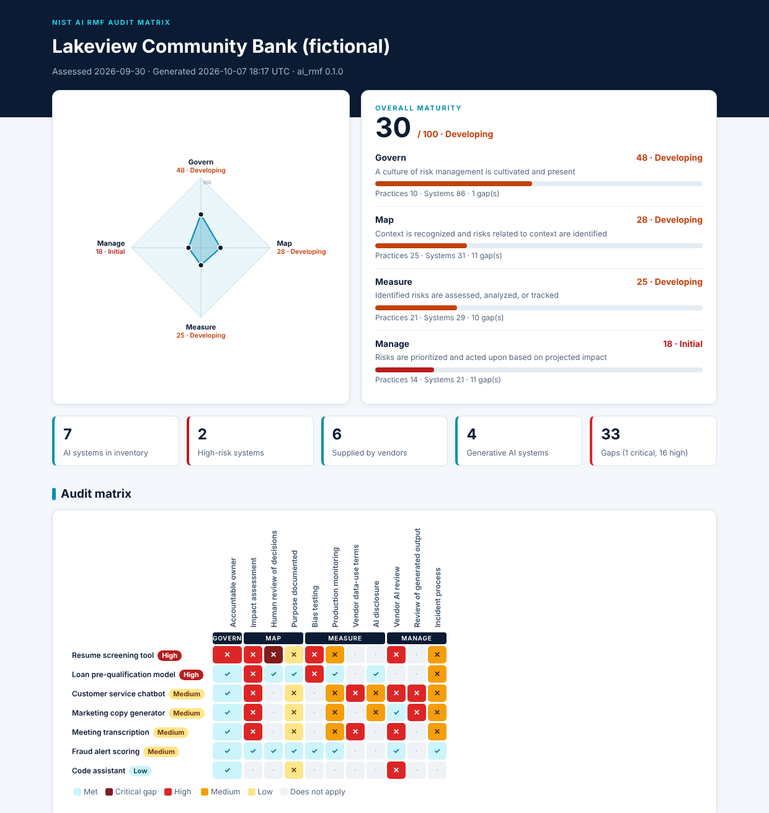

# AI RMF Audit Matrix

[](https://github.com/Edward-Owusu/ai-rmf-audit-matrix/actions/workflows/tests.yml)
[](LICENSE)
[](https://doi.org/10.5281/zenodo.23221698)
[](https://ai-rmf-audit-matrix.streamlit.app/)

An open-source tool for auditing how an organization manages the risks of the **artificial intelligence** it uses. It scores AI risk management maturity across the four functions of the **NIST AI Risk Management Framework (AI RMF)**, Govern, Map, Measure, and Manage, risk-tiers every AI system in use (including **AI switched on inside vendor products**), and maps each gap to an AI RMF subcategory and to the risks in the **NIST Generative AI Profile (NIST AI 600-1)**.

It is built for **small and mid-sized organizations**, such as community banks, credit unions, clinics, manufacturers, and logistics firms, and the auditors and advisors who support them.



## Why this matters

AI has arrived in smaller organizations mostly through the products they already buy. Customer service platforms add chatbots, applicant tracking systems add resume ranking, meeting tools add transcription and summaries, and staff adopt writing and coding assistants on their own. Many of these systems handle customer or employee data, and some influence decisions about people's credit, jobs, or access to services.

Large enterprises have AI governance committees, model risk teams, and specialist tooling. Smaller organizations often have no inventory of the AI they use, no one accountable for it, and no review of vendor terms that may allow customer data to be used to train the vendor's models. The NIST AI RMF and its Generative AI Profile describe what good practice looks like, but they are long, abstract documents that a small team struggles to turn into an audit.

This tool turns the framework into a practical audit: 18 plain-language program questions, a simple inventory template, and an audit matrix that shows exactly which systems fall short and how to fix them. It helps smaller organizations adopt AI responsibly, protects the customers and employees affected by automated decisions, and supports trustworthy AI across the U.S. economy.

## What it does

- Scores maturity from 0 to 100 in each AI RMF function and overall (**Initial, Developing, Defined, Managed**) and plots it on a **maturity radar**.
- Blends **program practices** (policies, roles, training, vendor review) with **evidence from the AI system inventory**, so a policy that is not applied to real systems does not score full marks.
- Places every AI system in a **High, Medium, or Low risk tier** based on the decisions it influences, the data it uses, and whether it faces customers.
- Runs **11 system-level checks**, including consequential decisions without human review, missing bias testing, vendor AI that was never reviewed, vendor terms that allow training on your data, undisclosed chatbots, and generative output reaching customers unreviewed.
- Draws an **audit matrix** of systems against checks, so it is clear whether gaps cluster in one system or run across the whole program.
- Maps every gap to **AI RMF subcategories** and **Generative AI Profile risks**, with a plain-language fix.
- Produces reports in **HTML, Markdown, CSV (one row per gap), and JSON**, with a command-line tool and an interactive **Streamlit dashboard**.
- Has **no third-party dependencies** in its core engine.

## Quick start

Requires Python 3.10 or later.

```bash
git clone https://github.com/Edward-Owusu/ai-rmf-audit-matrix.git
cd ai-rmf-audit-matrix
pip install -e .

ai-rmf samples/lakeview_bank --format html md csv
```

Example output:

```
Lakeview Community Bank (fictional) | assessed 2026-09-30
Overall maturity: 30/100 (Developing) | AI systems: 7 (high risk: 2) | gaps: 33 (critical 1, high 16)
  Govern      48  Developing
  Map         28  Developing
  Measure     25  Developing
  Manage      18  Initial
  High   Resume screening tool             8 gap(s)
  High   Loan pre-qualification model      3 gap(s)
  Medium Customer service chatbot          8 gap(s)
  Medium Marketing copy generator          6 gap(s)
  Medium Meeting transcription             6 gap(s)
  Medium Fraud alert scoring               0 gap(s)
  Low    Code assistant                    2 gap(s)
```

Open the HTML file in the `reports` folder for the radar, audit matrix, and remediation plan. Pre-generated reports are in [docs/example-reports](docs/example-reports).

### Dashboard

```bash
pip install -r requirements.txt
streamlit run app/streamlit_app.py
```
Try the hosted version at **https://ai-rmf-audit-matrix.streamlit.app/** (sample data only; do not upload confidential information to the public demo), or run it locally:

### Use in automation

`--fail-on` exits with code 2 when any gap is at or above the chosen severity, so the audit can run whenever the AI inventory changes:

```bash
ai-rmf assessment_folder --fail-on high
```

## Using your own data

1. Copy `samples/template/` to a new folder.
2. List every AI system in `ai_systems.csv`, including AI features in vendor products, as described in the [input reference](docs/data-reference.md).
3. Answer the 18 practices in `assessment.json` with `yes`, `partial`, or `no` (or answer them in the dashboard).
4. Run the tool and work through the gaps, starting with critical and high gaps on high-risk systems.

## Related projects

Part of a series of open-source GRC tools for small and mid-sized organizations:

- [NIST SP 800-53 Assessment Tool](https://github.com/Edward-Owusu/Nist-800-53-assessment-tool)
- [Zero Trust IAM Auditor](https://github.com/Edward-Owusu/Zero-trust-iam-auditor)
- [MFA Compliance Tracker](https://github.com/Edward-Owusu/mfa-compliance-tracker)
- [FedRAMP Cloud Analyzer](https://github.com/Edward-Owusu/fedramp-cloud-analyzer)
- [CMMC Readiness Toolkit](https://github.com/Edward-Owusu/cmmc-readiness-toolkit)
- [Vendor Risk Dashboard](https://github.com/Edward-Owusu/vendor-risk-dashboard)
- [Ransomware Resilience Framework](https://github.com/Edward-Owusu/ransomware-resilience-framework)
- [HIPAA Audit Engine](https://github.com/Edward-Owusu/hipaa-audit-engine)
- [SOX ITGC Audit Framework](https://github.com/Edward-Owusu/sox-itgc-audit-framework)

## Data and limitations

All sample data is synthetic and does not describe any real organization, person, or product; vendor names in the samples are invented. The tool scores the answers and inventory supplied, which should be supported by evidence. The NIST AI RMF is voluntary, and the checks are one practical reading of its outcomes for smaller organizations, not an official NIST mapping or a certification. The tool does not assess compliance with laws that govern specific AI uses, such as fair lending, employment, or consumer protection rules. See the [methodology](docs/methodology.md).

## References

- NIST AI 100-1, *Artificial Intelligence Risk Management Framework (AI RMF 1.0)*: https://doi.org/10.6028/NIST.AI.100-1
- NIST AI 600-1, *Artificial Intelligence Risk Management Framework: Generative Artificial Intelligence Profile*: https://doi.org/10.6028/NIST.AI.600-1
- NIST AI Risk Management Framework resources and Playbook: https://www.nist.gov/itl/ai-risk-management-framework

## Author

**Edward Owusu, CISA**, GRC Analyst and IT Auditor.

Feedback, issues, and contributions are welcome. If you use this tool in an AI governance or audit program, I would be glad to hear how it worked for you; please open an issue or get in touch.

## Citation

If you use this tool in research or professional work, please cite it using the metadata in [CITATION.cff](CITATION.cff).

## License

[MIT](LICENSE)
